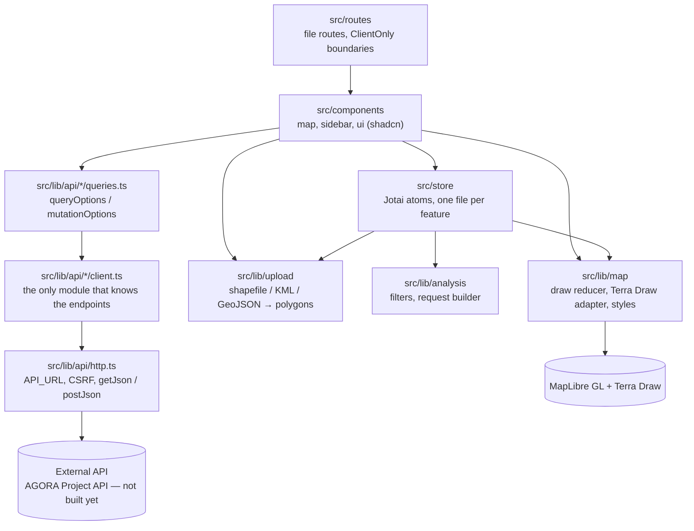

# Ágora Paraguay

Front end for the Ágora Paraguay platform, built with [TanStack Start](https://tanstack.com/start).

The API is **external and still being built**: every call reaches it, there is no mock data
left. See [Data layer](#data-layer) for how it is wired.

## Requirements

- Node **24** (`.nvmrc` — `nvm use`)
- pnpm **10.13.1** (pinned via `packageManager`; `corepack enable pnpm`)

## Getting started

```sh
nvm use
pnpm install
pnpm setup          # first production build (generates the route tree) + Playwright browser
pnpm dev            # http://localhost:3000
```

No `.env` file is needed — the app runs with sensible defaults (local Django behind the proxy,
built-in satellite basemap). Copy `.env.example` to `.env` only to override them; note that setting
`VITE_BASEMAP_STYLE_URL` makes the e2e tests hit the network for the style.

Auth, parcel filtering, metadata and analysis call the real Django API (see
[Data layer](#data-layer)): the app proxies `/api` to the backend — Vite in dev, Nitro in the
built server (`routeRules` in `vite.config.ts`) — so its session cookie stays first-party and
an https page never calls the plain-http API directly. The default target is a local Django on
port 8000; set `API_PROXY_TARGET` to reach the shared backend instead: in `.env` locally, in
the project's build environment on Vercel. It is read at build time, so changing it means
rebuilding. `VITE_API_URL` remains for a deployment where the browser can reach the API
directly (https, CORS and cookies configured on the backend). The e2e specs stub the auth routes
(`tests/e2e/fixtures/auth.ts`); signing in against the real backend is a manual check with a
personal account.

## Scripts

| Script                 | What it does                                            |
| ---------------------- | ------------------------------------------------------- |
| `pnpm dev`             | Dev server on port 3000                                 |
| `pnpm build`           | Production build into `.output`                         |
| `pnpm start`           | Runs the built server (`node .output/server/index.mjs`) |
| `pnpm setup`           | One-time bootstrap: build + install Playwright chromium |
| `pnpm check`           | Everything the CI `checks` job runs, in the same order  |
| `pnpm test`            | Unit tests (Vitest), single run                         |
| `pnpm test:unit`       | Same as `pnpm test`                                     |
| `pnpm test:unit:watch` | Unit tests, watch mode                                  |
| `pnpm test:coverage`   | Unit tests with coverage into `coverage/`               |
| `pnpm test:e2e`        | End-to-end tests (Playwright)                           |
| `pnpm test:e2e:ui`     | Playwright UI mode                                      |
| `pnpm typecheck`       | `tsc --noEmit`                                          |
| `pnpm lint`            | oxlint                                                  |
| `pnpm format`          | oxfmt, writes                                           |
| `pnpm format:check`    | oxfmt, check only (what CI runs)                        |

`pnpm build` generates `src/routeTree.gen.ts`, which `typecheck` and `lint` both need. On a fresh
clone, run `pnpm setup` (or at least `pnpm build`) before either — `pnpm check` handles the
ordering for you.

## Tests

Tests live outside `src`, split by kind:

```
tests/
  unit/   # Vitest, node environment — mirrors the src/ path of what it covers
  e2e/    # Playwright, real browser against the dev server
```

Unit tests cover pure logic (schemas, the API clients, map view and draw state); component
tests would need jsdom + testing-library, which is not set up. End-to-end specs drive the
real UI and stub the basemap style, so they need no network.

First run of `pnpm test:e2e` on a machine needs the Chromium browser once — `pnpm setup` installs
it (or run `pnpm exec playwright install chromium` directly).

New features and bug fixes come with tests: unit tests in `tests/unit/**` (mirroring the `src/`
path) for logic, e2e specs for user-visible behaviour.

## Architecture

Dependencies point one way: routes render components, components read and write the store,
the store and the components call pure logic in `src/lib`, and only the API layer talks to the
network. Nothing in `src/lib` imports from `src/store` or `src/components`.



Each layer's rules are spelled out in the sections below (data layer) and in the module
comments (`src/store/draw-core.ts`, `src/components/map/index.tsx`).

## Data layer

The API layer is organised by the domains of the API spec (auth, parcels, metadata, analysis).
Every domain has the same three files; the one fixture left sits behind its domain's `client.ts`:

```
src/lib/api/
├── http.ts                 Shared transport: API_URL, session/CSRF cookies, getJson/postJson, ApiError
├── auth/                   POST /api/auth/login/ (+csrf) — real; GET /api/auth/me/ parked (TODO(auth-me))
├── parcels/                POST /api/parcels/filter-parcels/
├── metadata/               GET /api/parcels/filters/?visibility= (hero fields); POST /api/parcels/analysis/{diseases|production}/ with no parcels (indicator list)
└── analysis/               POST /api/parcels/analysis/{diseases|production}/
    ├── schemas.ts          Zod schemas — the source of truth for types, wire shape as the spec writes it
    ├── client.ts           The ONLY module in the domain that knows the endpoint
    └── queries.ts          queryOptions factories — what components import
```

Rules that keep the swap cheap:

- Components import from a domain's `queries.ts` only, never from `client.ts`.
- Every response is parsed through the Zod schemas, so contract drift surfaces at the boundary
  instead of as `undefined` deep in a component.
- **Everything talks to the API; there is no mock switch.** The indicator list is the analysis
  `POST` of the riesgo with `parcel_ids` empty: same path, no parcels, the backend answers what
  it can score.
- Spec attributes marked "to be defined" are modelled loosely (`z.looseObject`) so the backend can
  add fields without breaking the parse; tighten them as the contract settles.

Query state is fetched on the client after hydration; SSR sends the shell and a loading state.
Wiring server-side prefetch (`@tanstack/react-router-ssr-query`) was deliberately deferred until
there is a real API and real payload sizes to justify it.

## Deployment

One build, two targets, both driven by Nitro. The preset comes from `NITRO_PRESET`
(see `vite.config.ts`).

### Vercel — current

Configuration lives in `vercel.json`, so it is versioned rather than set by hand in the dashboard:
framework `null`, `pnpm install --frozen-lockfile`, `pnpm build`, and `NITRO_PRESET=vercel` for the
build step. The one value that is not versioned is the backend: set `API_PROXY_TARGET` (the
Django origin, e.g. `http://46.60.18.203:8082`) as a build-time environment variable in the
Vercel project, then redeploy; `/api/*` on the deployment is relayed there by the server function.

With that preset Nitro emits the [Build Output API v3](https://vercel.com/docs/build-output-api/v3)
layout at **`.vercel/output`** — _not_ `.output`. Vercel detects that directory automatically, so
no output directory needs configuring. Confirm the build log reports the `vercel` preset rather
than `node-server`.

Connecting the repo to a Vercel project is a one-time manual step (`vercel link`, or importing the
repo in the dashboard).

### Docker — handover

The client's backend team deploys the container. CI builds the image on every PR so it cannot rot
between now and then.

```sh
docker build -t agora-paraguay .
docker run -p 3000:3000 agora-paraguay
```

`VITE_*` variables are inlined by Vite at **build** time, so they are `ARG`s in the Dockerfile, not
runtime environment variables.

## Decisions

Recorded so they are not re-litigated. All were checked against the
[Vizzuality Tech Radar](https://github.com/Vizzuality/vizzuality-engineering-handbook/tree/main/decisions/tech-radar)
on 2026-08-11.

- **TanStack Start over Next.js.** Trial tier, chosen deliberately. The external API removes most of
  Next's advantages (RSC data fetching, fetch cache, ISR). Org precedent:
  `climate_risk_index_for_biodiversity`, `vizz-json`, `acorn`.
- **TanStack Charts is excluded.** Pre-alpha (`0.11.0`), APIs documented as unstable, docs describe
  an unreleased branch, no org usage. Use **Recharts** for charts, **visx** where custom marks are
  needed.
- **Terra Draw** rather than `@mapbox/mapbox-gl-draw`, on **MapLibre GL JS v6** (upgraded
  2026-08-21; the earlier v5 pin is lifted). v6 resolves its render worker at runtime, so
  `src/components/map/index.tsx` sets the worker URL explicitly — without it the map renders blank.
- **oxlint + oxfmt**, not ESLint or Prettier (ADR 001). Correctness rules are set to `error`, and
  the full `jsx-a11y` rule set is enabled — stricter than oxlint's defaults, which only warn.
- **prek for git hooks, not Husky.** Husky is the Adopt-tier default and prek is Trial, so this is a
  deliberate exception following the `climate_risk_index_for_biodiversity` precedent. Do not install
  Husky alongside it: Husky sets `core.hooksPath=.husky`, which silently disables prek's hook.
- **Node 24, not 26.** Vercel only offers `20.x`, `22.x` and `24.x`, and Node 26 is still in its
  Current phase — it reaches LTS around October 2026, which is also when Vercel is expected to offer
  it. Dependabot is configured to ignore major bumps of `node` and `@types/node` so local, CI,
  Vercel and the container stay on the same major. Revisit in October.
- **Native `queryOptions`**, not `query-key-factory` (Hold tier, unmaintained).
- **Query data loads client-side after hydration.** SSR prefetch via
  `@tanstack/react-router-ssr-query` was deferred until there is a real API and real payload sizes.

`src/routeTree.gen.ts` is generated and gitignored. The `ignorePatterns` entries for it in
`.oxlintrc.json` and `.oxfmtrc.json` are therefore redundant — oxc tools honour `.gitignore` — but
are kept in case it is ever committed.

## Quality

Linting and formatting follow [ADR 001](https://github.com/Vizzuality/vizzuality-engineering-handbook/blob/main/decisions/adr/001-standardise-js-ts-quality-toolchain-on-oxc.md)
— **oxlint and oxfmt**, not ESLint or Prettier. `prek` installs the pre-commit hooks via
`pnpm install` (config in `prek.toml`; the hook runs oxfmt and oxlint on staged files).

Style is enforced by oxfmt, not by hand: single quotes (`singleQuote` in `.oxfmtrc.json`),
2-space indentation and 80-character wrapping (oxfmt defaults). Unused code is an oxlint error.
Two conventions the tools cannot check: give public functions, modules and variables meaningful
names — with a comment where intent isn't obvious from the code — and remove dead code rather
than commenting it out.

CI runs typecheck, lint, format check, unit tests, end-to-end tests, the production build, and the
Docker build on every pull request.

## Releases

[release-please](https://github.com/googleapis/release-please) keeps a release pull request open,
accumulating commits since the last release. Merging it bumps the version in `package.json`, writes
`CHANGELOG.md`, and tags the release.

This only works if commit subjects follow
[Conventional Commits](https://www.conventionalcommits.org/) — `fix:` produces a patch bump,
`feat:` a minor one, and `feat!:` or a `BREAKING CHANGE:` footer a major one. A commit that does not
parse contributes nothing to the changelog.
